# Hi 👋, I'm Hardik Saxena

### 🔐 Cybersecurity & Forensics Undergraduate | Cybersecurity | Cloud Security | Secure Software Development

---

<table>
<tr>
<td width="55%" valign="top">

## 👨‍💻 About Me

I'm a **B.Tech Cybersecurity & Forensics student at UPES Dehradun**, passionate about building secure software and solving real-world cybersecurity challenges.

I enjoy developing cloud security solutions, vulnerability detection systems, and cryptographic applications while continuously strengthening my problem-solving skills through DSA.

- 🎓 **B.Tech CSE (Cybersecurity & Forensics)** – UPES Dehradun | CGPA: 8.00
- 💼 **Internship Experience:** IBM, UJVNL & Right Zone Pvt. Ltd.
- 🛡️ **Interests:** Cybersecurity, Cloud Security, Penetration Testing, Vulnerability Assessment & Cryptography
- 🌱 **Currently Learning:** Advanced DSA, Cloud Security & Secure Software Development
- 💬 **Ask Me About:** Python, AWS, Cybersecurity, Cryptography & DSA
- 📧 **Email:** hardiksaxena2607@gmail.com

</td>

<td width="45%" align="center" valign="middle">

</td>
</tr>
</table>

---

## 🎓 Education

### B.Tech in Computer Science (Cybersecurity & Forensics)

**University of Petroleum and Energy Studies (UPES), Dehradun**

📅 2023 – 2027

📊 CGPA: **8.00**

---

## 🛠️ Technical Skills

### 🔹 Core CS Skills

- Data Structures & Algorithms
- Database Management Systems
- Object-Oriented Programming
- Operating Systems
- Computer Networks

### 🔹 Programming Languages

`C` `C++` `Python`

### 🔹 Cloud Technologies

`AWS` `S3` `IAM` `EC2` `CloudTrail`

### 🔹 Cybersecurity Tools

`Wireshark` `Burp Suite` `Nmap` `Nessus`

`Metasploit` `John the Ripper` `Cisco Packet Tracer`

### 🔹 Security Concepts

`Penetration Testing`

`Vulnerability Assessment`

`Incident Response`

`Network Security`

`OWASP Top 10`

`Cryptography`

`Secure Software Development`

`Cloud Security`

### 🔹 Development & Tools

`Git` `GitHub` `VS Code` `Postman`

---

## 💼 Internship Experience

### 🔹 IBM — Cloud Security Intern

- Developed Python-based security scanners to detect AWS cloud security misconfigurations.
- Implemented automated remediation reporting and severity-based risk classification.
- Worked with AWS security concepts and cloud infrastructure.

### 🔹 UJVNL — Cybersecurity Intern

- Worked on security monitoring and vulnerability assessment.
- Gained exposure to access control management and infrastructure security operations.
- Assisted with cybersecurity-related technical activities.

### 🔹 Right Zone Pvt. Ltd. — Software Development Intern

- Contributed to software development and debugging.
- Worked with SDLC workflows in a startup environment.
- Applied programming and problem-solving skills to practical development tasks.

---

# 🚀 Featured Projects

## ☁️ Cloud Security Misconfiguration Detection System

**Python • AWS • Boto3**

Developed automated security scanners for AWS services to identify cloud security misconfigurations across:

- Amazon S3
- IAM
- EC2
- CloudTrail

### Key Features

- Automated security scanning
- Rule-based risk classification
- Severity assessment
- Security findings generation
- Remediation recommendations

---

## 🔒 Otter Chat Encryption Tool

**JavaScript • C++ • X3DH • AES-256 • Curve25519**

Contributed to implementing end-to-end encrypted communication using modern cryptographic protocols.

### Security Features

- 🔐 End-to-end encryption
- 🔑 Secure key exchange
- 🛡️ X3DH protocol
- 🔒 AES-256 encryption
- 🔑 Curve25519 cryptography
- 🕵️ Privacy-focused communication
- 🧅 Tor Hidden Service support

---

## 🛡️ Fuzzinator

**Python • Machine Learning**

Developed intelligent fuzz testing pipelines using machine learning techniques to improve vulnerability detection and software robustness.

### Focus Areas

- Automated fuzz testing
- Vulnerability detection
- Input mutation
- Machine learning
- Software robustness

---

# 📜 Certifications

- 🏅 Cisco Networking Academy — Network Defense
- 🏅 DSPM Fundamentals — Securiti
- 🏅 YHills Cybersecurity Bootcamp

---

# 🏆 Achievements

- 🥈 Qualified for Smart India Hackathon 2025 — Internal Round
- 📄 Published Research:
  **A Unified Review of Advanced Paradigms in Spiking Neural Networks**

---

# 💻 Coding Profiles

<table>
<tr>
<td align="center" width="50%">

</td>
</tr>

<tr>
<td align="left">

</td>
</tr>
</table>

---

# 🌐 Connect With Me

<table>
<tr>
<td align="center" width="50%">

</td>
</tr>

<tr>
<td align="left">

</td>
</tr>

<tr>
<td align="left">

</td>
</tr>
</table>

---

# 📊 GitHub Stats

<table>
<tr>
<td width="50%" align="center">

</td>

<td width="50%" align="center">

</td>
</tr>
</table>

---

# 🔥 GitHub Streak

---

# 📈 GitHub Activity

---

# 🧠 Currently Learning

<table>
<tr>
<td align="center">

&nbsp;

&nbsp;

&nbsp;

</td>
</tr>

<tr>
<td align="left">

</td>
</tr>

<tr>
<td align="left">

</td>
</tr>

<tr>
<td align="left">

</td>
</tr>

<tr>
<td align="left">

</td>
</tr>
</table>

---

# 🎯 Career Interests

🔐 Cybersecurity &nbsp; • &nbsp;
☁️ Cloud Security &nbsp; • &nbsp;
🛡️ Application Security &nbsp; • &nbsp;
⚙️ Security Engineering &nbsp; • &nbsp;
🚀 DevSecOps &nbsp; • &nbsp;
🔎 Digital Forensics

---

# 📈 Profile Focus

### 🚀 Thanks for visiting my profile!

🔐 Building secure systems.

☁️ Exploring cloud security.

💻 Solving problems with code.

Let's build secure, scalable and reliable systems together.

---

### 🔐 Secure by Design • ☁️ Cloud by Default • 💻 Code with Purpose

